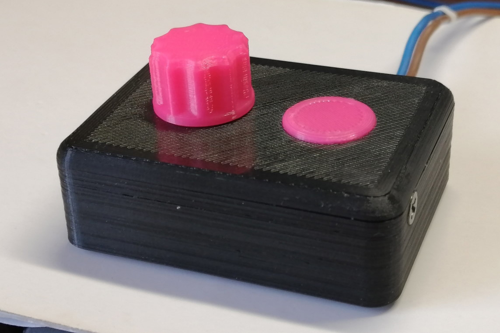

# LED Dimmer (Attiny26)

Компактный диммер для светодиодных лент 12V на Attiny26.  
[Ссылка на проект в EasyEDA](https://oshwlab.com/treegervd/attiny26_led)

Плата односторонняя, сделана для ЛУТа, имеет две перемычки.  
Примененный MOSFET __AO4468__ по даташиту максимально тянет 10.5A, но я столько не грузил.  
Для снижения потерь при переключении применен драйвер на __NE555__.  
Частота ШИМ ~ 2 кГц.

## Функционал:
Заполнение регулируется переменным резистором по CRT гамме. Включение/выключение осуществляется сенсорной кнопкой на __TTP223__.  
Реализовано плавное включение и затухание света.

## Документация:
[Attiny26](https://www.microchip.com/content/dam/mchp/documents/OTH/ProductDocuments/DataSheets/doc1477.pdf)  
[TTP223](https://datasheet.lcsc.com/szlcsc/TTP223-BA6_C80757.pdf)  
[AO4468](http://pdf.tixer.ru/161426.pdf)  
[NE555](https://chipster.ru/upload/files/datasheet/3/6/36.pdf)  

